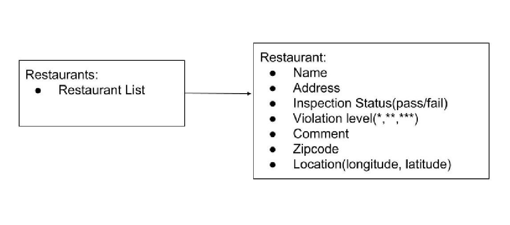
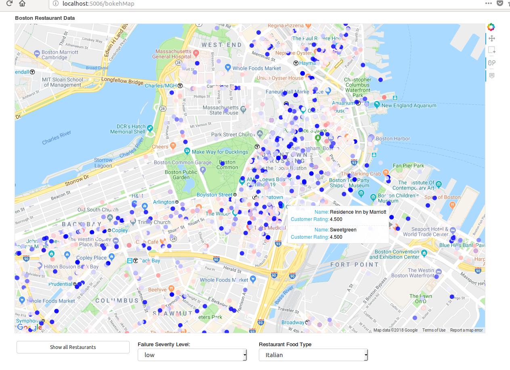

# Reflection
#### Authors: Sherrie Shen, William Fairman
## Project Overview
We wanted to visualize the City of Boston's data concerning the health ratings of local restaurants. This data, while providing crucial information, is only accessible in a csv file approximately half a million lines long. By implementing the Bokeh python library, we were able to display restaurants on Google maps in a format that made it easy to view the severity of their failed inspections and the percentage of failed inspections.


## Implementation
In order to store an accessible copy of the City of Boston's inspection data, we parsed through the given data and saved each row of the ```.csv``` file in a ```Restaurant``` object with attributes that included all relevant data such as name, address, and inspection status. We then combined all of the ```Restaurant``` objects as a ```Restaurants``` object whose attribute is a list of restaurant. The UML class diagram is shown below:



We conducted two main data analyses for data visualization: generating the overall failure percentage for each restaurant and creating the failure percentage by violation severity. For viewing the overall failure percentage of each restaurant, we calculated the number of times a restaurant failed an inspection and divided by the total number of times the restaurant had been inspected. For viewing the failure percentages by severity levels (\* or \*\* or \*\*\*), we computed the total number of times a restaurant failed for each severity level and divided by the total number of times the restaurant had been inspected. We then categorized the restaurants by grouping the ones with the most failures in severity \*, \*\*, and \*\*\* respectively.

The result of our data analysis is stored in four different dictionaries: overall failure percentages and failing percentages for each of the severity levels. The key of the dictionary is the restaurant name and the values are dictionaries with keys: percentages, RGB color, address of restaurant, location as in longitudes and latitudes, and food type queried from Yelp. The color for each restaurant is generated from a Matplotlib color-scale and reflects the percentage of failed inspections over the total number of inspections. We chose to store our data in a dictionary so that we can easily access the items  when using ```bokeh``` to specify the location of each data point on map, the name of each data point, and the color associated with each data point.

We decided to use the ```bokeh``` library to create a compelling user interface. This proved to be an adequate balance between having foundational code set by the library and writing code to represent our data set.  The library contained classes that defined the geoMap, the type of data point, the widgets used, types of events (button click, mouse location). This allowed us to spend more time creating an enjoyable experience for the user that involved interactive button control, sorting data into multiple subsets, and finding information for individual locations.


## Result
After compiling the visualization of our data, we noticed that about 5000 of the 7000 restaurant data points failed most often at low violation severity level. The second most frequent violation level, with about 1500 restaurants, was the most severe violation level. The remaining 24 restaurants mainly achieved medium violation severities. This reflects a trend of restaurants achieving either minor health inspection failures or very severe failures. As for overall failing percentages, the majority of the restaurants failed roughly 50% of their inspections: with a few restaurants on the extremes of spectrum.

When comparing the overall failure percentages to their severity level, we noticed that most restaurants with higher failing percentages tend to have an overall lower level of violation severity. Moreover, customer rating is not necessarily inversely proportional to the failure percentages or severity level. Fast food restaurants, such as McDonald's, that conventionally leave an impression of low food satisfaction have low inspection failure percentages and tend to fail at a lower severity level. Restaurants that are more popular, on the other hand, might not score well in terms of inspection failure percentages.

We used the ```Bokeh Server``` to create an interactive space for our data. The picture below shows each restaurant with the color reflecting their inspection failure percentage (blue being low, red being high). The map includes buttons that allow the user to sort through different groups of data (food type, failure severity, etc). The map also includes a hover feature that reveals the name of the restaurant and its customer rating when the user hovers over a data point.



## Reflection
For this project, we adapted the divide and conquer approach with one person mainly in charge of the data analysis aspect and another person in charge of visualizing the data using ```bokeh```. This approach went well in terms of preventing merge conflict and allowing each person to have a smooth and uninterrupted logic for the code. We also meet from time to time to check in with each other on the progress, explain the  and list things that need to be done. One main issue is that since the project is divided between data analysis and visualization, it is hard to verify our analyses and visualization without using the other. As a result, the integration became tedious and problems such as what is the best way to show the data and use of color scale popped up. To address this problem, we would probably try being more involved in each major component of the code. More time spent planning the style of file types and overall structure of our project would also have helped mitigate some issues.

This project allowed us to think of different ways to parse a data with different features, store it in a way to easily accessible, and plot it interactively to generate useful insight. We scoped the project fairly well and spent the majority of time working on achieving our MVP. The project involved an adequate mixture of features from the previous projects and interactive features highlighted in this project. In response to previous projects, we implemented a better schedule that involved working on the code in a distributed fashion throughout the two weeks. While we spent several hours finishing the code the night before, most of the time was spent achieving our stretch goals and organizing our work in a presentable fashion.
