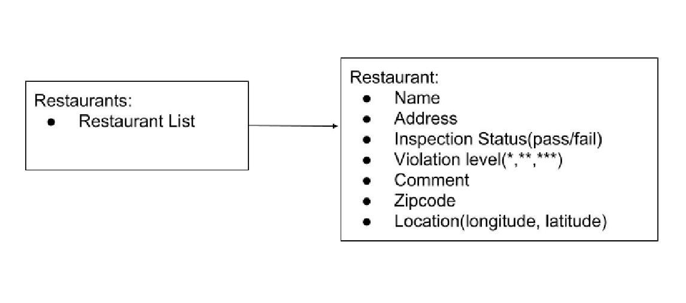

# Reflection
#### Authors: Sherrie Shen, William Fairman
## Project Overview
We wanted to visualize the City of Boston's data concerning the health ratings of local restaurants. This data, while providing crucial information, is only accessible in a csv file approximately half a million lines long. By implementing the Bokeh python library, we were able to display restaurants on Google maps in a format that made it easy to view the severity of their failed inspections and the percentage of failed inspections.


#Implementation
We parsed the restaurant inspection data by storing each row in the ```.csv``` file in a ```Restaurant``` object and assign columns with relevant data such as name, address, inspection Status and etc to the attribute of the ```Restaurant``` object. For later data analysis, we create a ```Restaurants``` object whose attribute is a list of restaurant. The UML class diagram is shown below:



We conducted two main data analysis for data visualization: view overall failure percentage for each restaurant or view failure percentage by violation severity. For viewing overall failure percentage for each restaurant, we calculate the number of times a restaurant failed the inspection divided by the total number of times the restaurant had been inspected. For viewing failing percentages by severity levels (* or ** or ***), we compute the total number of times a restaurant failed for each severity level divided by the total number of times the restaurant being inspected. Then we categorized the restaurants by grouping the ones with severity * as the highest failing percentage, the ones with severity ** as the highest failing percentage and the ones with severity *** as the highest failing percentage.

The data analysis result is stored in four different dictionaries: failing percentages overall and failing percentages for each of the severity level. The keys of the dictionary is the restaurant name and the values are dictionaries with keys: percentages, color generated by mapping the percentages from 0-100 range to RGB , address of restaurant, location as in longitudes and latitudes and food type queried from Yelp. The color is used to indicate the color of the datapoint in the interactive map. For the color scale of choise from Matloplib. We choose to store our data into a dictionary so that we can easily access the item  when using ```bokeh``` to specify the location of the datapoint on map, the name of the datapoint and the color associated.

For visualizing the data, the ```bokeh``` library,  


## Result
From visualization by severity levels, we notice that about 5000 of the 7000 restaurant data points we had failed most often at low severity violation and about 15000 restaurants failed most often at high severity violation and the rest at medium severity violation. There is a trend of failing at the opposite ends of the spectrum.


As for overall failing percentages, the majority of the restuarants failed at about 50% or lower of the times it being inspected. There are only a few restuarant that failed at high percentages. 

When comparing the overall failing percentages to the severity level, we notice that most restaurants that higher failing percentages tend to have low severity violations. Moreover, customer rating is also not direclty porportional to the failing percentages or failing severity level. Fast food restaurants such as McDonald's that conventionally left an impression of low food secruity actually have a low failing percentage and tends to fail at low severity level. Restuarants that are more popular, on the other hand, might not score well in terms of inspection failure percentages.

## Reflection

T